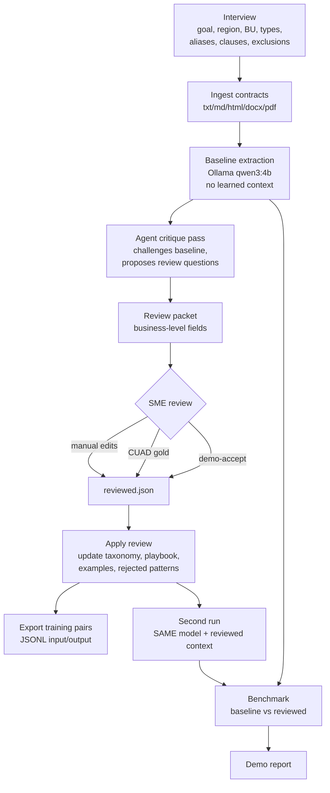

# Contract Intelligence MVP — Flow

End-to-end loop for the Code Games contract corpus discovery prototype: interview → ingest → baseline → critique → review → relearn → benchmark.

## High-Level Flow



## Stage Detail

| # | CLI command | Reads | Writes | Engine |
|---|---|---|---|---|
| 1 | `init` | — | `data/` skeleton, seed interview cfg | — |
| 2 | `interview --config …` | `config/interview.example.json` | `data/memory/interview.json`, merges `data/memory/taxonomy.json` | local or LivingOS API Codex (`LIVINGOS_API_INTERVIEW=1`) |
| 3 | `ingest --input <folder>` | `sample_corpus/`, `data/raw_contracts/…` | `data/corpus/documents.jsonl` (normalized chunks) | parsers (pdftotext, docx, html) |
| 4 | `baseline --model qwen3:4b` | corpus + interview | `data/runs/baseline_results.json` | Ollama @ 127.0.0.1:11434 → fallback heuristic |
| 5 | `agent-analyze --model qwen3:4b` | baseline | `data/runs/agent_analysis.json` (critique, review Qs, memory suggestions) | Ollama → heuristic |
| 6 | `review-packet` | baseline + critique | `data/reviews/review_packet.pending.json` | deterministic |
| 7a | manual SME edit | pending packet | `review_packet.reviewed.json` | human |
| 7b | `cuad-apply-gold` | CUAD annotations | reviewed.json | deterministic |
| 7c | `demo-accept-review` | pending | reviewed.json (dry run) | deterministic |
| 8 | `apply-review --review …` | reviewed.json | updates `data/memory/taxonomy.json` (taxonomy, clause-family seeds, aliases, examples, playbook, rejected patterns) + `data/training/training_pairs.jsonl` | deterministic |
| 9 | `second-run --model qwen3:4b` | corpus + reviewed taxonomy | `data/runs/second_run_results.json` | same Ollama model, reviewed context only |
| 10 | `benchmark` | baseline + second run | `data/runs/benchmark.json` (contract-type accuracy delta) | deterministic |
| 11 | `demo-report` | benchmark + memory | `data/runs/demo_report.md` | deterministic |
| — | `ui` | all `data/` outputs | local web workbench :8765 | FastAPI/static |

## Memory Surfaces

```
data/
├── memory/
│   ├── interview.json       # goal, region, BU, expected types, exclusions
│   └── taxonomy.json        # types, clause families, aliases, examples,
│                            # playbook, rejected patterns  ← learned
├── corpus/documents.jsonl   # normalized text
├── runs/
│   ├── baseline_results.json
│   ├── agent_analysis.json
│   ├── second_run_results.json
│   ├── benchmark.json
│   └── demo_report.md
├── reviews/
│   ├── review_packet.pending.json
│   └── review_packet.reviewed.json
└── training/training_pairs.jsonl   # JSONL input/output for future SFT
```

## Improvement Loop (the point of the MVP)

```
              ┌────────────────────────┐
   corpus ──►│ Same Ollama model       │──► baseline
              │ no learned context      │
              └────────────────────────┘
                          │
                       critique
                          │
                       review packet
                          │
                       SME / CUAD gold
                          │
              ┌────────────────────────┐
              │ taxonomy + playbook +   │
              │ examples + rejected     │  ← reviewed context
              │ patterns                │
              └────────────────────────┘
                          │
              ┌────────────────────────┐
   corpus ──►│ Same Ollama model       │──► second_run
              │ + reviewed context      │
              └────────────────────────┘
                          │
                       benchmark
```

The improvement claim is **reviewed-context learning** (taxonomy/playbook/examples/rejected memory), not weight fine-tuning. Exported `training_pairs.jsonl` is queued for future SFT.

## Engine Fallback

Every model call records `engine: "ollama" | "heuristic_fallback"` so the full demo path runs even when Ollama is offline or returns invalid JSON.

## Two Demo Paths

- **Synthetic smoke:** `sample_corpus/` (tiny EDGAR-style files).
- **CUAD one-command:** `contract-intel demo-cuad --model qwen3:4b --limit 4 --contains license` → reset, interview, stage CUAD, ingest, baseline, agent-analyze, review-packet, apply CUAD gold, apply-review, second-run, benchmark, demo-report.
- **Real EDGAR:** `edgar-sample --limit 10` → ingest → same loop with manual SME review.
